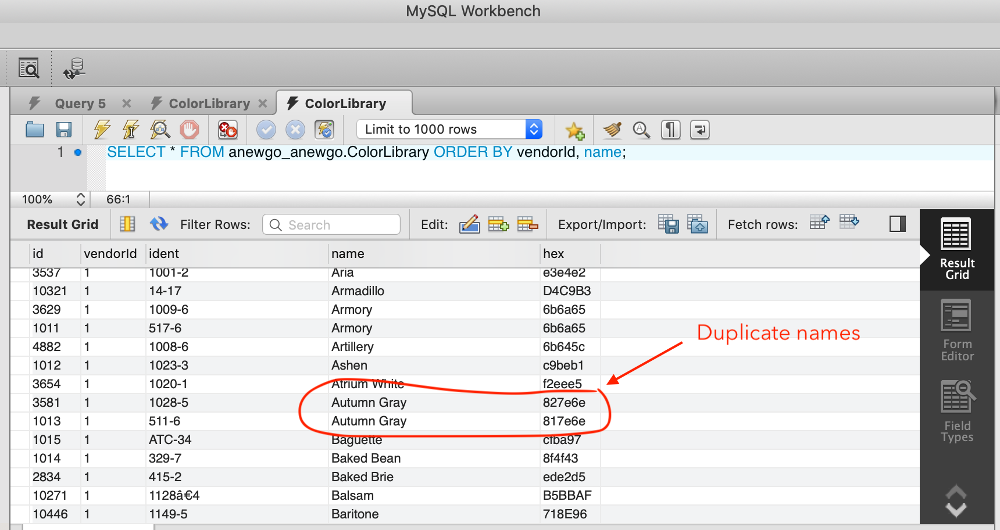

# PAINT STORE

## OVERVIEW

This app serves as a complete client-server system that reads data from a color library and displays the colors in a web interface. The color library has colors from a variety of paint vendors. The user interface includes the ability to select a paint vendor and view all the colors from the paint vendor.

#### Demo the project [HERE](https://rh-paint-store.herokuapp.com)

## PRELIMINARY

The data provided comes as two MySQL tables. However, there are duplicates in the color data. Your first task is to deduplicate the data.

Here is an example of what duplicate data looks like:

For the purpose of this project, rows in the `ColorLibrary.sql` table are considered duplicates if the following columns are the same:

- `vendorId`
- `name`

The deduplication method should always retain the row that has the highest `id` value.

#### The solution for the deduplication is contained within the `db_scripts/dedup_script.sql` file

## SERVER

The server for your system will need to do the following at a minimal:

1. Provide an API service for retrieving color data.

   <ul>
      <li>
        The methods to call the API are contained in the `server/controllers/paintStore.js` file
      </li>
      <li>
        The routes are contained in the `server/routes` directory
      </li>
   </ul>

2. The API service should read the data from a database hosted at a remote endpoint.

   <ul>
     <li>
       The database is hosted using JAWSDB via heroku
     </li>
   </ul>

## CLIENT

1. Provide a user interface to select a paint vendor and display the set of colors for a given paint vendor.

2. Display color information for each color.

## Other Features

1. Intuitive UI Design.

2. The ability to show all colors from all vendors.

3. The ability to filter vendors within a selector.

4. Infinite scrolling in your display area. (Planned)

5. Color Search capability. (Planned)
